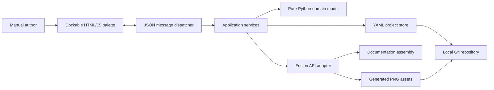

# Fusion Manual Scene Manager - Architecture Package

This package defines the first deliverable of **Fusion Manual Scene Manager (FMSM)**, a Fusion add-in for authoring, storing, restoring, and rendering repeatable assembly-manual scenes.

The package is written for implementation by Codex or another software engineering agent. It intentionally stops at the local, interactive first deliverable. Later automation is documented only as a roadmap.

## First deliverable

The add-in must let a manual author:

1. Initialize or open a manual project associated with the active Fusion documentation assembly.
2. Create a scene from the current Fusion state.
3. Store a title, description, purpose, and Markdown instruction text for each scene.
4. Capture and restore camera, occurrence visibility, component opacity, and occurrence transforms.
5. View an ordered scene list with thumbnails.
6. Edit metadata, duplicate scenes, delete scenes, and reorder scenes.
7. Generate final and thumbnail PNGs under stable filenames.
8. Validate missing or duplicate stable identifiers and broken scene references.
9. Store project and scene definitions as human-readable YAML in a local Git repository.
10. Restore the user's pre-scene Fusion state after rendering or on explicit request.

## Scope boundary

Do **not** implement these roadmap features in the first deliverable:

- GitHub Actions or cloud rendering
- Fusion Automation API integration
- dependency-aware stale-scene detection
- automatic partial rebuilds after repository changes
- visual image-diff approval workflows
- callout-anchor projection
- InDesign, Typst, Quarto, or PDF generation
- BOM generation or instruction inference
- automatic external-reference updating
- multi-user locking or hosted collaboration

## Recommended reading order

1. `CODEX_IMPLEMENTATION_BRIEF.md`
2. `AGENTS.md`
3. `docs/01_PRODUCT_REQUIREMENTS.md`
4. `docs/02_SYSTEM_ARCHITECTURE.md`
5. `docs/03_DATA_MODEL_AND_SCHEMA.md`
6. `docs/04_UI_UX_SPEC.md`
7. `docs/05_IMPLEMENTATION_PLAN.md`
8. `docs/06_TEST_STRATEGY.md`
9. `docs/07_ROADMAP.md`
10. `docs/08_RISKS_AND_API_NOTES.md`
11. `docs/adr/*`

Machine-readable schemas and example YAML are under `schemas/` and `examples/`.

## Architecture summary

## Definition of done

The first deliverable is complete only when all acceptance tests in `docs/06_TEST_STRATEGY.md` pass in Fusion and all pure-Python tests pass outside Fusion.
