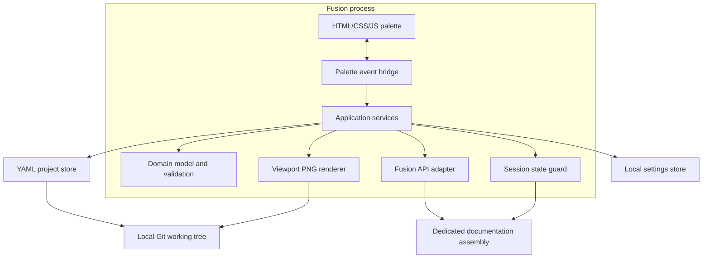

# 2. System Architecture

## 2.1 Architectural style

Use a layered, ports-and-adapters architecture. The Fusion API and the palette are volatile platform boundaries; scene data, validation, and use-case logic should remain ordinary Python.



## 2.2 Layer responsibilities

### UI layer

The dockable palette owns presentation only:

- scene list and forms;
- drag-and-drop order;
- dirty indicators;
- confirmation dialogs;
- progress and error display;
- construction of JSON messages.

It must not parse or write YAML, resolve Fusion entities, or decide business rules.

### Message bridge

The Python add-in listens to incoming palette events and sends response events. Every request includes:

```json
{
  "protocol_version": 1,
  "request_id": "uuid",
  "action": "scene.render",
  "payload": {"scene_id": "uuid"}
}
```

Every response includes:

```json
{
  "protocol_version": 1,
  "request_id": "same-uuid",
  "ok": true,
  "result": {}
}
```

Errors use stable codes:

```json
{
  "protocol_version": 1,
  "request_id": "same-uuid",
  "ok": false,
  "error": {
    "code": "SCENE_REFERENCE_MISSING",
    "message": "Scene references an occurrence that is not present.",
    "details": {"occurrence_id": "...", "label": "Left DIN rail:1"}
  }
}
```

### Application layer

Application services implement use cases and coordinate ports:

- `InitializeProject`
- `OpenProject`
- `ListScenes`
- `CreateSceneFromCurrentState`
- `UpdateSceneMetadata`
- `CaptureSceneSections`
- `ApplyScene`
- `RestoreSessionState`
- `DuplicateScene`
- `DeleteScene`
- `ReorderScenes`
- `ValidateProject`
- `RenderScene`

Application services contain no direct UI code and no direct `adsk` imports.

### Domain layer

The domain layer defines:

- project and scene models;
- camera and matrix value objects;
- validation issues and severity;
- stable identity records;
- filename and slug rules;
- schema version behavior.

Domain models should be created from primitive dictionaries and serialized back to primitive dictionaries.

### Fusion adapter

The Fusion adapter owns all `adsk` access:

- active document/design checks;
- document identity lookup;
- assembly traversal;
- attribute read/write;
- camera capture/apply;
- occurrence light-bulb capture/apply;
- component opacity capture/apply;
- occurrence matrix capture/apply;
- viewport refresh and image export.

### Persistence layer

The YAML store owns:

- `manual.yaml` and scene-file parsing;
- schema-version checks;
- deterministic serialization;
- atomic writes;
- relative-path validation;
- manifest order updates;
- file deletion after domain confirmation.

### Local settings layer

A machine-local settings file maps immutable project IDs to local repository roots. This prevents machine-specific paths from entering Git or cloud document metadata.

Example:

```json
{
  "schema_version": 1,
  "projects": {
    "0fbb1ed7-2e82-4e61-a5f8-83a2ed41e9db": {
      "root": "/Users/name/work/printer-docs",
      "last_opened": "2026-07-17T13:00:00Z"
    }
  }
}
```

The active Fusion document stores only the project UUID attribute, not the path.

## 2.3 Recommended source layout

```text
addin/
└── FusionManualSceneManager/
    ├── FusionManualSceneManager.py
    ├── FusionManualSceneManager.manifest
    ├── bootstrap.py
    ├── fmsm/
    │   ├── domain/
    │   │   ├── models.py
    │   │   ├── validation.py
    │   │   ├── identifiers.py
    │   │   └── filenames.py
    │   ├── application/
    │   │   ├── services.py
    │   │   ├── ports.py
    │   │   └── errors.py
    │   ├── infrastructure/
    │   │   ├── yaml_store.py
    │   │   ├── settings_store.py
    │   │   ├── atomic_write.py
    │   │   └── logging_config.py
    │   ├── fusion/
    │   │   ├── adapter.py
    │   │   ├── identity_service.py
    │   │   ├── camera_adapter.py
    │   │   ├── assembly_state_adapter.py
    │   │   ├── state_guard.py
    │   │   └── renderer.py
    │   └── messaging/
    │       ├── dispatcher.py
    │       └── protocol.py
    ├── ui/
    │   ├── palette.html
    │   ├── app.js
    │   ├── styles.css
    │   └── icons/
    ├── vendor/
    │   └── yaml/
    └── resources/
schemas/
examples/
tests/
├── unit/
├── contract/
└── fusion_integration/
```

## 2.4 Project association

### Initialization

1. User opens the dedicated documentation assembly.
2. User selects **Initialize Manual Project**.
3. Add-in confirms the dedicated-assembly recommendation.
4. User selects or creates a local project root.
5. Add-in writes `manual.yaml`, `scenes/`, and asset directories.
6. Add-in adds `fmsm/project_id` to the active Fusion document.
7. Add-in writes the project-ID-to-path mapping to local settings.

### Reopening

1. Add-in reads the active document's project ID.
2. Add-in resolves the local path from settings.
3. If missing, user selects the existing project root.
4. Add-in verifies that `manual.yaml` contains the same project ID.

## 2.5 Stable identity architecture

Use two separate UUID namespaces stored as attributes:

- occurrence attribute group `fmsm`, name `occurrence_id`;
- component attribute group `fmsm`, name `component_id`.

Friendly labels are stored alongside references in YAML:

```yaml
occurrence_id: 5ceae402-b6b4-4a27-88db-2a3b6b27d54f
label: Left DIN Rail:1
part_number: RAIL-DIN-200
```

Resolution always uses the UUID. Labels are diagnostics and diff context.

### Collision policy

- Missing IDs may be assigned during explicit **Ensure IDs** or scene creation.
- Duplicate IDs are blocking errors.
- The add-in must not choose an arbitrary duplicate during scene apply.
- A repair command may assign new IDs to all but one duplicate, but it must show which scenes may require recapture.

## 2.6 Scene application order

Apply a scene in this order:

1. Validate active project and scene.
2. Build current identity indexes.
3. Capture pre-scene session state if no session state is active.
4. Resolve all scene references; stop before mutation on blocking errors.
5. Apply occurrence transforms in root context.
6. Apply component opacity.
7. Apply occurrence light-bulb states.
8. Hide unlisted occurrences and emit warnings.
9. Apply camera and refresh viewport.
10. Return warnings and applied-state summary.

This order reduces visual churn and ensures the final camera is applied after geometry moves.

## 2.7 Render transaction

Rendering must behave like a guarded transaction:

```python
original = fusion.capture_session_state()
try:
    fusion.apply_scene(scene)
    fusion.refresh_viewport()
    renderer.save_png(scene.output)
    renderer.save_thumbnail(scene.output)
finally:
    fusion.restore_session_state(original)
    fusion.refresh_viewport()
```

The restore path must run even if image export or thumbnail generation fails.

## 2.8 Document modification policy

Scene transforms and display overrides may mark the documentation assembly as modified. The add-in:

- never saves automatically;
- shows a persistent dedicated-assembly warning;
- offers **Restore Previous State**;
- attempts state restoration when the palette closes, the add-in stops, or the active document changes;
- logs restoration failures prominently.

Crash-proof non-mutating exploded graphics are a later-phase option, not an MVP requirement.

## 2.9 Palette performance

The scene-list response returns metadata and thumbnail paths, but not all image bytes. The UI requests thumbnails lazily for visible rows. The Python side returns a base64 data URL for a requested thumbnail. Cache invalidation uses file modification time.

## 2.10 Security boundaries

- Palette content is bundled locally; no remote scripts or CDNs.
- All incoming actions are allow-listed.
- Request payloads are checked before dispatch.
- YAML uses safe loading.
- Output paths are resolved and checked to remain under project root.
- Scene deletion cannot delete outside the project's `scenes/` and asset directories.
- HTML rendering of metadata escapes user content.
- Markdown is stored but not executed.

## 2.11 Logging and diagnostics

Use a local rotating log containing:

- timestamp;
- application version;
- Fusion version if available;
- project and scene IDs;
- action;
- warning/error code;
- stack trace for unexpected failures.

The palette presents concise messages and an **Open Log Folder** command.
